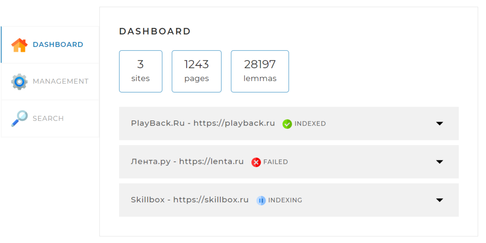
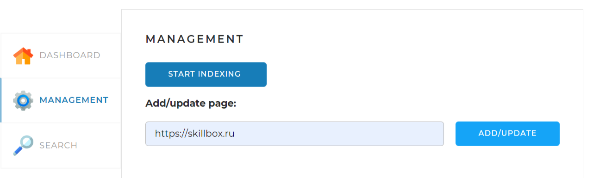
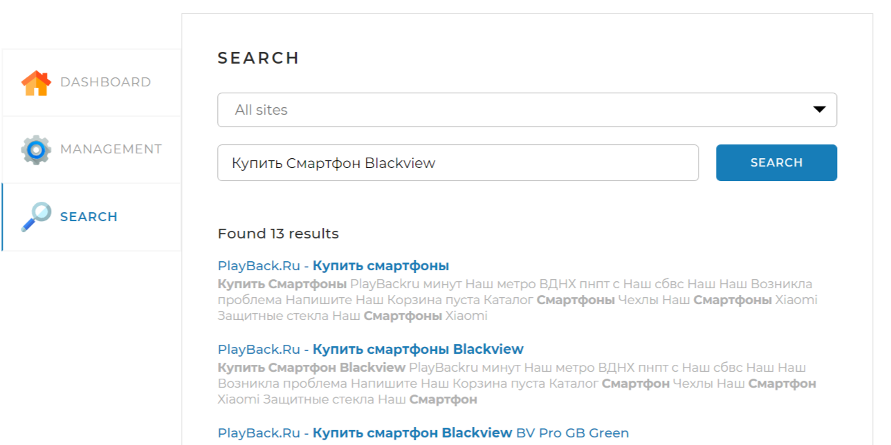

<h1 align="center">Search Engine "Bezdna"</h1>

***


📄<b>_Stack_</b>:
SpringBoot, Hibernate, JDBC, Lombok,
SQL, Morphology Library, JSOUP.

***

## Description

> SpringBoot application. <br>
> The search engine receives sites from the application.yaml. Using ForkJoinPool collects
> information about sites, collect lemmas using the morphology library and writes
> it to the MySQL database. RestControllers provides interface to search information 
> by query. The application returns a list of pages with a small description on request.

- Sites in application.yaml 
 ``` yaml
indexing-settings:
  sites:
    - url: https://playback.ru
      name: PlayBack.Ru
    - url: https://lenta.ru
      name: Лента.ру
    - url: https://skillbox.ru
      name: Skillbox
```

***
## Opportunities
#### 1. Dashboard 🏠
> Allows you to view site indexing statistic.



#### 2.Management ⚙️
> Allows you to <b>start indexing</b> all sites or index separate site.



#### 3.Search 🔍

> Allows you to <b>search</b> on one site or on all at the same time. 



***

## API Specification

* GET /api/startIndexing  ⌛

> Starts indexing of all sites in specified application.yaml. <br>
> Returns an error if indexing is already running.

* POST /api/indexPage?{url} 🆕
> Starts index/reindex webpage given in parameter.
> URL must be related to the domen names given in application.yml.

* GET /api/statistics 📊
> Returns info about indexing sites.

* GET /api/search?{**query**}&{**site**}&{**limit**}&{**offset**} 🔍
> Performs a search on websites. <br> 
>> **Parameters:**
>> - **query** - search query.
>> - **site** - site to search(if not set, engine going through all sites); <br>
>> Format url : http://site.com.
>> - **offset** - skip N results to show(if not set show all results based on calculated relevancy).
>> - **limit** - number of pages to show(if not set default number is 20).

---

## Read this before starting

- Create an empty database **search_engine**
 ``` roomsql
create database search_engine;
 ``` 

- Change the datasource setting in application.yaml.
 ``` yaml
spring:
  datasource:
    username: <username>
    password: <password>
    url: jdbc:mysql://localhost:3306/search_engine###
 ``` 

- To change sites for indexing, open application.yaml, insert the **name** and **url**
 ``` yaml
indexing-settings:
  sites:
    - url: <Url site>
      name: <Name site>
 ``` 

***